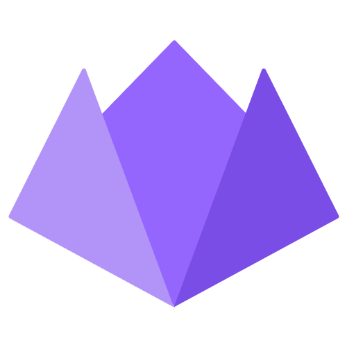

## Hi 👋, I'm Rafael Fragoso

I'm a passionate full-stack software engineer from Brazil.

Between being  a full-time dad and a full-stack developer, I venture myself on learning new programming languages like Golang or Rust during my free time.

If you would like to hire me, feel free to reach me at [rafaelfragosom@gmail.com](mailto:rafaelfragosom@gmail.com).

Also, if you're in Rio, Brazil, let's hike or go for a run together.

Keep on hacking!

<h3 align="left">Connect with me:</h3>

